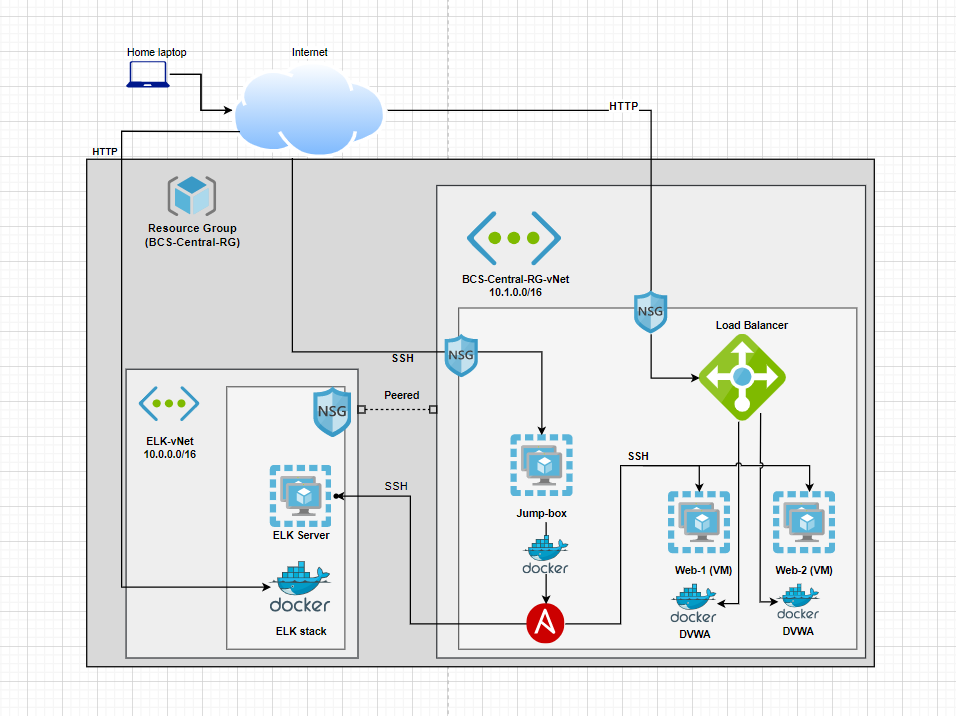
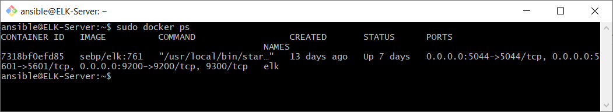

## Automated ELK Stack Deployment

The files in this repository were used to configure the network depicted below.

These files have been tested and used to generate a live ELK deployment on Azure. They can be used to either recreate the entire deployment pictured above. Alternatively, select portions of the install-elk.yml file may be used to install only certain pieces of it, such as Filebeat.

This document contains the following details:
- Description of the Topology
- Access Policies
- ELK Configuration
  - Beats in Use
  - Machines Being Monitored
- How to Use the Ansible Build

### Description of the Topology

The main purpose of this network is to expose a load-balanced and monitored instance of DVWA, the D*mn Vulnerable Web Application.

Load balancing ensures that the application will be highly available, in addition to restricting access to the network.
- Load balancers shield the VMs behind them by providing confidentiality of how many machines are hosting the website.
- A jumpbox supports the confidentiality provided by the load balancer because it is an access point to the vms. It makes it so they do not have to be exposed to the public internet directly in order for admins to patch or deploy to them.

Integrating an ELK server allows users to easily monitor the vulnerable VMs for changes to the files and system metrics.
- Filebeat watches for changes to files on the monitored system.
- Metricbeat records system performance values like CPU and memory usage.

The configuration details of each machine may be found below.

| Name       | Function   | IP Address              | Operating System |
|------------|------------|-------------------------|------------------|
| Jump-box   | Gateway    | 10.1.0.8 104.43.217.192 | Linux            |
| Web-1      | Web Server | 10.1.0.5                | Linux            |
| Web-2      | Web Server | 10.1.0.6                | Linux            |
| Elk-Server | ELK Server | 10.0.0.4                | Linux            |

### Access Policies

The machines on the internal network are not exposed to the public Internet. 

Only the Jump Box machine can accept connections from the Internet. Access to this machine is only allowed from the following IP addresses: [my home ip]

Machines within the network can only be accessed by the Jump Box, including the ELK VM.

A summary of the access policies in place can be found in the table below.

| Name      | Publicly Accessible | Allowed IP Addresses |
|-----------|---------------------|----------------------|
| Jump-box  | Yes                 | [my home ip], virtual network |
| Web-1     | No                  | 10.1.0.8                      |
| Web-2     | No                  | 10.1.0.8                      |
| ELK-Server| No                  | [my home ip], 10.1.0.8        |

### Elk Configuration

Ansible was used to automate configuration of the ELK machine. No configuration was performed manually, which is advantageous because it makes the process repeatable. The same exact steps can be done again on another machine.

The playbook implements the following tasks:
- Install docker
- Install python 3 package manager and the python docker module
- Download and launch ELK docker container
- Ensure docker starts on boot

The following screenshot displays the result of running `docker ps` after successfully configuring the ELK instance.

### Target Machines & Beats
This ELK server is configured to monitor the following machines:
- Web-1: 10.1.0.5
- Web-2: 10.1.0.6

We have installed the following Beats on these machines:
- Filebeats and Metricbeats

### Using the Playbook
In order to use the playbook, you will need to have an Ansible control node already configured. Assuming you have such a control node provisioned: 

SSH into the control node and follow the steps below:
- Copy the elk-playbook.yml file to /etc/ansible/roles.
- Update the hosts file to include the IP address of the machine in the desired group. For this project, we had two groups: webservers and elk.
- Run the playbook, and navigate to the public IP of the ELK Server to check that the installation worked as expected.